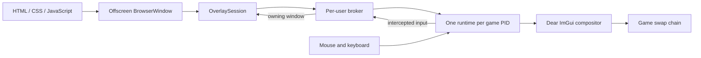

# Electron Game Overlay

Render Electron interfaces inside Windows games.

Your overlay remains an ordinary HTML/CSS/JavaScript application running in
Electron. The library captures offscreen `BrowserWindow` frames, composites
them on the game's Direct3D swap chain, and routes intercepted mouse and
keyboard input back to the correct Electron window.

## Support

| Area                         | Supported boundary                    |
| ---------------------------- | ------------------------------------- |
| Host                         | Windows 10 or newer, x64              |
| Electron                     | `>=39.1.0 <40`                        |
| Target architecture          | x64 and x86/PE32                      |
| Graphics APIs                | Direct3D 9, 10, 11, and 12            |
| Existing official ReShade    | x64, when its public add-on API works |
| Multiple apps in one process | Exact-PID attachment                  |
| Anti-cheat                   | Unsupported                           |

OpenGL, Vulkan, VR, and Electron 40 or newer are not currently supported.

## How it works



The browser never runs inside the game. Electron renders each overlay page to
an offscreen bitmap in your application process. `OverlaySession` publishes
those frames, their bounds, visibility, and order to the injected runtime. The
runtime uploads the frames and draws them through Dear ImGui during the game's
normal presentation.

`ReShadeOverlayLauncher` connects the two sides. It must attach near process
creation, before the game creates the graphics device or swap chain. The
application does not select D3D9, D3D10, D3D11, or D3D12; the runtime observes
the API used by the target.

When input interception is enabled, supported game input is consumed by the
runtime and translated back to Electron. Hit testing, focus, text input,
scrolling, dragging, and normal DOM events continue to work in the overlay.

Independent applications attaching to the same exact PID share one injected
runtime automatically. Their windows and input remain isolated by application;
the broker is an implementation detail and has no public API.

## Try a demo

Install the workspace and prepare the runtime once:

```powershell
npm install
npm run demo:prepare
```

With the target game closed, start the basic example:

```powershell
npm run demo:basic-window -- --target-process="game.exe"
```

Wait for `Injector watcher ready`, then launch the game. The demo runner adds
the required runtime opt-in automatically.

See [`demos`](demos) for all focused examples and their launch commands.
`apps/client` is the larger validation application, not the recommended place
to learn the SDK.

## Application setup

The SDK is used from Electron's main process. Disable Electron GPU acceleration
before `ready`, create one overlay session, create the offscreen windows you
want to publish, and attach a launcher to the target.

```ts
import { app } from 'electron';
import path from 'node:path';
import {
  ElectronGameOverlay,
  ReShadeOverlayLauncher,
  isReShadeOperationError,
  parseReShadeLaunchConfig,
} from 'electron-game-overlay';

app.disableHardwareAcceleration();

const config = parseReShadeLaunchConfig(process.argv);
if (!config) {
  throw new Error('Start Electron with --reshade-overlay.');
}

const overlay = new ElectronGameOverlay();
const session = overlay.createSession();
const launcher = new ReShadeOverlayLauncher(config);

launcher.onEvent((event) => {
  if (event.type === 'injector-watcher-ready') {
    console.log('The watcher is ready; launch game.exe now.');
  }
});

app.on('before-quit', () => {
  session.input.release();
  launcher.dispose();
  overlay.dispose();
});

void app.whenReady().then(async () => {
  await Promise.all([session.whenReady(), launcher.prepare()]);

  const window = session.windows.create({
    id: 'main-overlay',
    bounds: { x: 48, y: 48, width: 480, height: 300 },
    captionHeight: 44,
    dragBorder: 8,
    transparent: true,
    file: path.join(__dirname, 'renderer', 'index.html'),
    browserWindow: {
      frame: false,
      transparent: true,
      backgroundColor: '#00000000',
      webPreferences: {
        preload: path.join(__dirname, 'preload.js'),
        contextIsolation: true,
        nodeIntegration: false,
        sandbox: true,
        backgroundThrottling: false,
      },
    },
  });

  window.show();

  const result = await launcher.attach(session, {
    processName: 'game.exe',
  });

  console.log(`Attached to PID ${result.pid} through ${result.runtimeMode}`);
});
```

Start the compiled Electron entry point with the explicit opt-in:

```powershell
npx electron path\to\main.js --reshade-overlay
```

For a production application, handle the rejected `attach()` promise and
surface diagnostics as shown below.

## Attach to a target

There are three attachment forms. Choose the one that matches how your
application discovers games.

| Target             | When to use it                                                        |
| ------------------ | --------------------------------------------------------------------- |
| Exact PID and path | Recommended for a process watcher and required for multi-app sharing  |
| Executable name    | Arm the launcher before a known game starts                           |
| Path fragment      | Watch a directory family such as `steamapps` before matching launches |

### Exact process

Prepare the launcher before process detection so staging is not on the
time-sensitive attachment path. When your watcher observes a new process,
attach immediately:

```ts
await launcher.prepare();

const result = await launcher.attach(session, {
  processName: observed.name,
  pid: observed.pid,
  executablePath: observed.path,
});
```

The path is optional, but providing the trusted absolute path lets the launcher
inspect an existing ReShade installation without guessing. Its basename must
match `processName`.

One launcher represents one target lifecycle. If several processes can overlap,
create and prepare one launcher per detected PID while sharing the same
`OverlaySession`.

The [`steam-auto-attach`](demos/steam-auto-attach) example demonstrates this
pattern with application-owned process events and one exact-PID attachment per
detected executable.

After your watcher has definitive operating-system proof that the process
exited, release that lifecycle:

```ts
launcher.confirmTargetExited(observed.pid);
launcher.dispose();
```

Do not infer exit from a dropped overlay connection. The graphics runtime can
disconnect temporarily while the process is still alive.

### Executable name

Name attachment starts a native watcher before the process exists:

```ts
launcher.onEvent((event) => {
  if (event.type === 'injector-watcher-ready') {
    launchTheGame();
  }
});

const result = await launcher.attach(session, {
  processName: 'game.exe',
});
```

Do not launch the target until `injector-watcher-ready`. The event means the
watcher is armed, not that injection or runtime initialization has succeeded.

### Path watcher

Path attachment follows the same pre-launch rule:

```ts
const result = await launcher.attach(session, {
  pathContains: '\\steamapps\\',
});
```

The watcher attempts matching executable launches independently. Processes
already running when its initial baseline is captured are ignored.

### Attachment timing

Attachment must happen before the target finishes creating its graphics device
or swap chain. An exact PID discovered a few seconds after process creation may
still be early enough; attaching after the game is already rendering is not a
supported path.

`attach()` resolves only after the injected side authenticates. Its
`runtimeMode` explains how the target was connected:

| Mode               | Meaning                                                        |
| ------------------ | -------------------------------------------------------------- |
| `injected-runtime` | This application initialized the isolated bundled runtime      |
| `existing-runtime` | A compatible project runtime was already loaded                |
| `official-addon`   | An existing official ReShade loaded the overlay add-on         |
| `shared-runtime`   | Another application initialized the runtime for this exact PID |

## Create overlay windows

`session.windows.create()` constructs an offscreen `BrowserWindow` and returns
an `ElectronOverlayWindow` wrapper. The page, preload, IPC, DevTools, and
renderer architecture remain ordinary Electron.

```ts
const inventory = session.windows.create({
  id: 'inventory',
  bounds: { x: 40, y: 40, width: 600, height: 420 },
  captionHeight: 44,
  dragBorder: 8,
  transparent: true,
  file: absoluteHtmlPath,
  browserWindow: {
    frame: false,
    transparent: true,
    backgroundColor: '#00000000',
    webPreferences: {
      preload: absolutePreloadPath,
      contextIsolation: true,
      nodeIntegration: false,
      sandbox: true,
      backgroundThrottling: false,
    },
  },
});

inventory.show();
```

`captionHeight` and `dragBorder` define the draggable regions used by the
in-game compositor. `transparent` describes compositor behavior; the
`BrowserWindow` and page background must also be transparent if you want
see-through pixels.

You can instead publish a `BrowserWindow` that your application already owns:

```ts
const browserWindow = new BrowserWindow({
  show: false,
  webPreferences: {
    offscreen: true,
    contextIsolation: true,
    nodeIntegration: false,
    sandbox: true,
    backgroundThrottling: false,
  },
});

const inventory = session.windows.attach(browserWindow, {
  id: 'inventory',
  captionHeight: 44,
  dragBorder: 8,
});
```

Electron cannot enable offscreen rendering after a window is constructed, so
an attached window must already have `webPreferences.offscreen: true`.

Common window operations are intentionally close to Electron:

| Operation                     | Effect                                                        |
| ----------------------------- | ------------------------------------------------------------- |
| `show()` / `hide()`           | Add or remove the surface from the in-game compositor         |
| `setBounds()` / `getBounds()` | Change or read its Electron DIP bounds                        |
| `focus()` / `blur()`          | Change which overlay web view receives routed input           |
| `followTarget()`              | Resize and position it from a live game render/client surface |
| `stopFollowingTarget()`       | Stop following and restore its previous bounds                |
| `destroy()`                   | Remove the wrapper and its resources                          |

`show()` does not display a desktop window. It registers the offscreen surface
with the target compositor. Bounds passed to the public API use Electron DIP;
the SDK performs the physical-pixel and DPI conversion for the target.

Destroying a window created by the SDK also closes its backing
`BrowserWindow`. Destroying a wrapper around an attached window unregisters it
without closing the caller-owned `BrowserWindow`.

## Intercept input

Input interception is session-wide and asynchronous:

```ts
session.input.intercept();

session.on('inputInterceptionChanged', ({ pid, intercepting }) => {
  console.log(`PID ${pid}: ${intercepting ? 'captured' : 'released'}`);
});

session.input.release();
```

While interception is acknowledged as active, supported mouse, keyboard,
hover, wheel, text, focus, dragging, and pointer-capture input is routed to the
overlay and blocked from the game. The game keeps foreground ownership; the
hidden Electron window does not need to become the foreground desktop window.

The SDK does not register a shortcut. The application decides when the overlay
should capture input. Register Electron global shortcuts only after
`app.whenReady()` resolves:

```ts
import { globalShortcut } from 'electron';

let intercepting = false;

globalShortcut.register('CommandOrControl+I', () => {
  intercepting = !intercepting;
  intercepting ? session.input.intercept() : session.input.release();
});
```

`Ctrl+I` is only a demo convention. Always release input during shutdown.

## Follow the game and read telemetry

A window can follow the most recently changed matching target surface:

```ts
window.followTarget(); // render area, latest surface
window.followTarget({ area: 'client' }); // Win32 client area
window.followTarget({ pid, surfaceId }); // explicit target surface
window.stopFollowingTarget();
```

Follow mode responds to game resize, DPI, monitor, and fullscreen changes. It
keeps the previous raster active until Electron has painted a correctly sized
replacement frame, avoiding a stretched transitional frame.

Target state is available both as retained snapshots and typed events:

```ts
session.on('targetSurfaceChanged', (surface) => {
  console.log(surface.graphicsApi, surface.renderSize, surface.fullscreen);
});

session.on('fps', ({ pid, fps }) => {
  console.log(`PID ${pid}: ${fps.toFixed(1)} FPS`);
});

const surfaces = session.targets.list();
const surface = session.targets.get(pid, surfaceId);
```

The most useful session events are:

| Event                      | When it fires                                           |
| -------------------------- | ------------------------------------------------------- |
| `targetConnected`          | An injected target has authenticated                    |
| `targetTransportLost`      | Its transport ended, but process exit is not proven     |
| `targetDisconnected`       | The exact target process is confirmed gone              |
| `targetSurfaceChanged`     | Render size, API, window, DPI, or display state changed |
| `targetSurfaceRemoved`     | A previously published surface was retired              |
| `fps`                      | A new target render-rate sample is available            |
| `inputInterceptionChanged` | The target acknowledged an input-policy change          |
| `windowFocused`            | Routed input changed the focused overlay window         |
| `diagnostic`               | A structured session observation is available           |

Every subscription returns a function that removes that listener. FPS comes
from the primary game render surface, not Electron's paint rate.

## Handle failures and diagnostics

Launcher failures use `ReShadeOperationError` when the SDK can provide a
stable diagnostic:

```ts
try {
  await launcher.attach(session, target);
} catch (error) {
  if (!isReShadeOperationError(error)) throw error;

  console.error(error.code, error.stage, error.message);
  console.error(error.diagnostic.evidence);

  if (error.retrySafety === 'indeterminate') {
    // Do not inject this still-running PID again.
  }
}
```

`definite-safe` means retrying cannot duplicate a loaded runtime.
`indeterminate` means the SDK cannot prove another injection would be safe; wait
for definitive target exit and use a new launcher for the next process.

Running-session diagnostics are separate from attachment failures:

```ts
const unsubscribe = session.on('diagnostic', (event) => {
  console.log(event.source, event.severity, event.code, event.message);
});
```

Diagnostics identify whether a failure came from the Electron producer,
transport, target authentication, runtime, frame upload, or input routing. The
exported TypeScript union gives the current codes and payload fields.

## Multiple independent applications

Applications that observe the same process can each call `attach()` with the
same exact PID. They do not need to discover or communicate with one another.

The SDK guarantees that compatible applications:

- share one injected runtime and one target connection;
- may reuse the same application-local window IDs safely;
- receive input and focus only for windows they own;
- combine interception requests so the game is released only after every app
  releases or disconnects;
- keep working when another participating application exits or crashes.

The first compatible broker remains in charge for that target lifecycle. SDK
versions can coexist when they retain the protocol-v1 compatibility contract;
new optional behavior is used only when both sides support it. Versions from
before broker support cannot join a broker-owned target.

The broker currently starts through the application's Electron executable with
`ELECTRON_RUN_AS_NODE=1`. Packaged applications using exact-PID attachment must
keep Electron's RunAsNode fuse enabled until the project ships a dedicated
broker executable.

Name-only and path-watcher attachment cannot share a known PID ahead of time,
so those legacy modes remain exclusive. Use an application process watcher and
exact-PID attachment whenever overlap is possible.

See [`doc/multi-application-broker.md`](doc/multi-application-broker.md) for the
internal election, recovery, and versioning design.

## Existing ReShade installations

For a clean target, the isolated injected runtime does not add files to the
game directory.

When exact-PID attachment finds an existing target-local x64 ReShade, the SDK
preserves that installation and tries to load `electron_game_overlay.addon64`
through ReShade's public add-on interface. It does not replace the existing
runtime, configuration, presets, effects, or other add-ons. If compatibility
cannot be established, attachment fails instead of falling back to a second
injected ReShade runtime.

Installing or updating the overlay add-on in an existing ReShade installation
requires the game to restart. A disabled or conflicting reserved add-on is
left untouched and reported as an error. Existing target-local x86 ReShade is
not currently supported, although clean x86 targets are supported through the
isolated runtime.

## Lifecycle rules

- One `ElectronGameOverlay` owns at most one active `OverlaySession`.
- Closing the session lets the same overlay create another session.
- Disposing the overlay is permanent.
- A launcher represents one target lifecycle; create separate launchers for
  overlapping target processes.
- Closing a session destroys SDK-created windows and detaches caller-owned
  windows.
- Closing the application removes its scene and interception request without
  disrupting other applications attached to the same target.
- Session shutdown does not unload already mapped code from a running game.
  Target exit is the supported runtime teardown.

## Examples

Each example keeps its Electron main process, preload, renderer, HTML, styles,
and explanation in one folder.

| Example                                                            | Demonstrates                                      | Command                          |
| ------------------------------------------------------------------ | ------------------------------------------------- | -------------------------------- |
| [`basic-window`](demos/basic-window)                               | One offscreen Electron window                     | `npm run demo:basic-window`      |
| [`exact-process-attachment`](demos/exact-process-attachment)       | Process-watcher PID/path handoff                  | `npm run demo:exact-process`     |
| [`input-interception`](demos/input-interception)                   | Application-owned input toggle                    | `npm run demo:input`             |
| [`multiple-windows`](demos/multiple-windows)                       | Multiple independently managed windows            | `npm run demo:multiple-windows`  |
| [`target-follow-and-telemetry`](demos/target-follow-and-telemetry) | Geometry, DPI, graphics API, FPS, and follow mode | `npm run demo:target-follow`     |
| [`steam-auto-attach`](demos/steam-auto-attach)                     | Watching and attaching Steam executable launches  | `npm run demo:steam-auto-attach` |

See [`demos/README.md`](demos/README.md) for launch arguments and demo-specific
instructions.

## API map

The README documents workflows and behavior. The exported TypeScript
declarations are the API source of truth and are included in the package build,
so signatures and option fields stay synchronized with the implementation.

| Runtime export                    | Responsibility                                              |
| --------------------------------- | ----------------------------------------------------------- |
| `ElectronGameOverlay`             | Owns the SDK backend and creates one active session         |
| `OverlaySession`                  | Owns windows, input policy, target snapshots, and events    |
| `ElectronOverlayWindow`           | Controls one published offscreen Electron surface           |
| `ReShadeOverlayLauncher`          | Prepares and attaches one target process lifecycle          |
| `ReShadeOperationError`           | Carries structured attachment failure and retry information |
| `isReShadeOperationError`         | Narrows an unknown failure to that structured error         |
| `parseReShadeLaunchConfig`        | Parses and validates explicit startup configuration         |
| `defaultReShadeRuntimeDirectory`  | Resolves the runtime artifacts staged with the SDK          |
| `defaultReShadeRunsRootDirectory` | Resolves the default writable per-attachment run directory  |

Start from the package export list in
[`src/lib/sdk.ts`](libs/electron-game-overlay/src/lib/sdk.ts). The declaration
sites for the main API are:

- [`ElectronGameOverlay`](libs/electron-game-overlay/src/lib/electron-game-overlay.ts)
- [`OverlaySession`](libs/electron-game-overlay/src/lib/overlay-session.ts)
- [`ElectronOverlayWindow`](libs/electron-game-overlay/src/lib/electron-overlay-window.ts)
- [window, telemetry, event, and diagnostic types](libs/electron-game-overlay/src/lib/types.ts)
- [launcher configuration, results, events, and errors](libs/electron-game-overlay/src/lib/reshade-launcher.ts)

Use editor autocomplete or the emitted `.d.ts` declarations for exact
signatures instead of copying type definitions from this README.

## Limitations and safety

- Injection must beat graphics initialization; general attachment after a game
  is already rendering is unsupported.
- Anti-cheat-protected and competitive targets are outside the support and
  safety boundary. Do not use this runtime to bypass anti-cheat controls.
- The unsigned runtime can be blocked by the target or security software.
- OpenGL, Vulkan, VR, unusual exclusive-fullscreen paths, and arbitrary
  presentation layouts are not supported.
- Gamepads, DirectInput, XInput, GameInput, touch/pen policy, and arbitrary
  engine-specific input paths are not universally intercepted.
- Existing official-ReShade integration is currently x64 only.
- Runtime and add-on code is not unloaded while the target remains alive.
- Same-PID multi-application sharing requires exact-PID attachment and a
  protocol-v1-compatible SDK.
- Electron 40 and newer require a new offscreen-raster and DPI compatibility
  pass before support can be widened.

See [`doc/known-issues.md`](doc/known-issues.md) for detailed compatibility and
hardening boundaries.

## Build and test

Repository tooling requires Node.js `^20.19.0 || >=22.12.0`. Building the
native runtime from source additionally requires Visual Studio 2022 with the
C++ desktop workload, Rust, CMake 3.24 or newer, and both Rust Windows targets:

```powershell
rustup target add --toolchain stable x86_64-pc-windows-msvc i686-pc-windows-msvc
```

Build and test the public SDK:

```powershell
npm install
npx nx build electron-game-overlay
npx nx run electron-game-overlay:test
```

Type-check and smoke-test the examples:

```powershell
npm run demo:typecheck
npm run demo:smoke
```

Native runtime contributors should use the dedicated launchers under
[`libs/electron-game-overlay-runtime/scripts/test-cases`](libs/electron-game-overlay-runtime/scripts/test-cases).
The full runtime build and acceptance guide is in
[`libs/electron-game-overlay-runtime/README.md`](libs/electron-game-overlay-runtime/README.md).

## License

Licensed under GPLv3. See [`LICENSE`](LICENSE).
