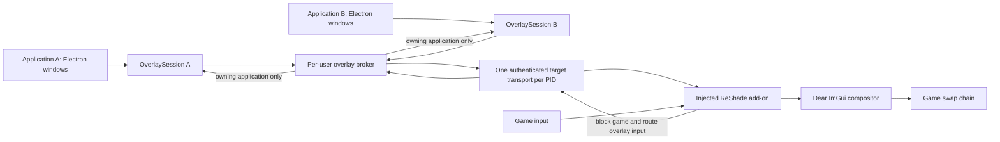

# Electron Game Overlay

Render ordinary Electron interfaces inside Windows games through ReShade and
Dear ImGui.

Electron windows remain normal HTML, CSS, and JavaScript applications. The SDK
captures their offscreen Chromium frames, transports an ordered multi-window
scene to the injected target, renders it on the game's swap chain, and returns
intercepted input to the correct Electron web view.

The package uses maintained Node and Electron APIs and does not load a native
Node add-on. It is currently consumed from this repository and is not published
to npm.

## Compatibility

| Component                 | Current boundary                        |
| ------------------------- | --------------------------------------- |
| Host                      | Windows 10 or newer, x64                |
| Electron                  | `>=39.1.0 <40`                          |
| Target architectures      | x64 and x86/PE32                        |
| Target graphics APIs      | Direct3D 9, 10, 11, and 12              |
| Existing official ReShade | Fail-closed x64 integration             |
| Same-PID applications     | Exact-PID broker protocol v1            |
| OpenGL, Vulkan, and VR    | Not accepted support claims             |
| Anti-cheat                | Unsupported and explicitly out of scope |

The packaged runtime implements D3D9, D3D10, D3D11, and D3D12 for both target
architectures. Controlled end-to-end acceptance covers all four APIs on x64
and D3D9/D3D10 on x86. Portal's PE32 `hl2.exe` also has a user-confirmed
real-game D3D9 smoke test. That smoke test does not replace the controlled
restart, resize, interception, and cleanup matrix.

Electron 40 and newer are intentionally outside the peer range. Their
offscreen bitmap scaling behavior needs a separate raster/display-scale
contract and mixed-DPI acceptance before support can be widened safely.

## How it works



The repository is split into four useful layers:

- [`libs/electron-game-overlay`](libs/electron-game-overlay) is the public
  Electron/TypeScript SDK and runtime launcher.
- [`libs/electron-overlay-transport`](libs/electron-overlay-transport) owns the
  Rust scene, authentication, input routing, and versioned native ABI.
- [`libs/electron-game-overlay-runtime`](libs/electron-game-overlay-runtime)
  builds the x64/x86 ReShade hosts, add-ons, injectors, coexistence manager, and
  controlled test hosts.
- [`demos`](demos) contains small applications intended for SDK readers.
  [`apps/client`](apps/client) is the larger validation client, not the
  recommended place to learn the API.

Each attachment gets an isolated writable run directory. Schema-versioned
SHA-256 build manifests bind the architecture-specific injector, runtime,
manager, add-on, configuration, and build stamps before staging and again
before injection. A clean target uses that isolated runtime without copying
proxy DLLs or configuration into the game directory.

Exact-PID attachments rendezvous through a versioned per-user broker. The
broker briefly collects independently starting providers, selects the highest
compatible staged runtime generation, maps every application's local window
IDs into one target scene, and lets compatible applications join the
already-running target without injecting another runtime.

## Requirements and build

Repository tooling requires Node.js `^20.19.0 || >=22.12.0` and npm. Native
runtime builds additionally require:

- Visual Studio 2022 with **Desktop development with C++**;
- Rust through `rustup`;
- CMake 3.24 or newer;
- Git and internet access for the first native configure.

TypeScript is intentionally held on the current 6.x line: TypeScript 7 can
compile the sources directly, but Nx 23.1.1 cannot build its project graph with
that compiler API yet. Electron 39 and `@types/node` 22 are likewise deliberate
runtime-contract pins rather than missed dependency updates.

Install both Rust targets:

```powershell
rustup target add --toolchain stable x86_64-pc-windows-msvc i686-pc-windows-msvc
```

Install dependencies and build the SDK:

```powershell
npm install
npx nx build electron-game-overlay
```

The built package is written to `libs/electron-game-overlay/dist`. Its staged
Windows runtime is under
`libs/electron-game-overlay/dist/runtime/win32-x64/reshade`.

Build both the SDK and validation client with:

```powershell
npm run build:all
```

## Minimal application

Create the SDK objects in Electron's main process. Name-based attachment must
be armed before the target starts; an already-rendering device or swap chain is
not adopted.

```ts
import { app } from 'electron';
import path from 'node:path';
import {
  ElectronGameOverlay,
  ReShadeOverlayLauncher,
  isReShadeOperationError,
  parseReShadeLaunchConfig,
} from 'electron-game-overlay';

app.disableHardwareAcceleration();

const config = parseReShadeLaunchConfig(process.argv);
if (!config) {
  throw new Error('Start Electron with --reshade-overlay.');
}

const overlay = new ElectronGameOverlay();
const session = overlay.createSession();
const launcher = new ReShadeOverlayLauncher(config);

app.on('before-quit', () => {
  session.input.release();
  launcher.dispose();
  session.close();
  overlay.dispose();
});

void app.whenReady().then(() => {
  const overlayWindow = session.windows.create({
    id: 'main-overlay',
    name: 'Main overlay',
    bounds: { x: 48, y: 48, width: 480, height: 280 },
    captionHeight: 48,
    dragBorder: 8,
    transparent: true,
    focusOnReady: true,
    file: path.join(__dirname, 'renderer', 'index.html'),
    browserWindow: {
      frame: false,
      transparent: true,
      backgroundColor: '#00000000',
      skipTaskbar: true,
      webPreferences: {
        preload: path.join(__dirname, 'preload.js'),
        contextIsolation: true,
        nodeIntegration: false,
        sandbox: true,
        backgroundThrottling: false,
      },
    },
  });

  overlayWindow.show();

  session.on('diagnostic', (diagnostic) => {
    console.log(diagnostic.source, diagnostic.code, diagnostic.message);
  });

  launcher.onEvent((event) => {
    if (event.type === 'injector-watcher-ready') {
      console.log('Injector watcher ready. Launch game.exe now.');
    }
  });

  void launcher
    .attach(session, { processName: 'game.exe' })
    .then((result) => {
      console.log(`Attached to ${result.processName}, PID ${result.pid}`);
      console.log(`Runtime mode: ${result.runtimeMode}`);
    })
    .catch((error: unknown) => {
      if (isReShadeOperationError(error)) {
        console.error(
          error.code,
          error.stage,
          error.retrySafety,
          error.diagnostic.evidence,
        );
      } else {
        console.error(error);
      }
    });
});
```

Pass the explicit runtime opt-in exactly once:

```powershell
npx electron path\to\main.js --reshade-overlay
```

The repository demo runner adds this flag automatically.

## Readable examples

Every example keeps its own `main.ts`, `preload.ts`, `renderer.ts`,
`index.html`, assets, and README together.

| Example                                                            | Purpose                                           | Command                          |
| ------------------------------------------------------------------ | ------------------------------------------------- | -------------------------------- |
| [`basic-window`](demos/basic-window)                               | One offscreen Electron window                     | `npm run demo:basic-window`      |
| [`exact-process-attachment`](demos/exact-process-attachment)       | Process-watcher PID/path handoff                  | `npm run demo:exact-process`     |
| [`input-interception`](demos/input-interception)                   | App-owned shortcut and input policy               | `npm run demo:input`             |
| [`multiple-windows`](demos/multiple-windows)                       | Independent window composition                    | `npm run demo:multiple-windows`  |
| [`target-follow-and-telemetry`](demos/target-follow-and-telemetry) | Geometry, DPI, API, FPS, and follow mode          | `npm run demo:target-follow`     |
| [`steam-auto-attach`](demos/steam-auto-attach)                     | One independent attempt per Steam-path executable | `npm run demo:steam-auto-attach` |

Prepare the native demo runtime once after installing dependencies:

```powershell
npm run demo:prepare
```

The individual launchers then preserve that staged runtime and rebuild only the
SDK TypeScript and selected Electron example. Run the preparation command again
after changing native runtime sources.

To launch every example sequentially with isolated Electron profiles and no
real target, run `npm run demo:smoke`. It verifies each main process, preload,
renderer bundle, overlay transport, and process watcher, including both windows
in the multiple-window example.

The five single-target commands default to `Gun Frog.exe` so they can be
launched without parameters. Append `-- --target-process="game.exe"` to choose
another target. Exact-PID examples additionally accept `--target-pid` and
`--target-path`; without them they use the prearmed name-watcher path.

For name-based examples, start the demo, wait for its `Injector watcher ready`
terminal message, and then launch the game. Exact-PID examples model an
immediate process-watcher callback. Manually entering the PID of a game that is
already rendering is not a supported late-attachment path.

## Target attachment

### Process name

```ts
await launcher.attach(session, { processName: 'game.exe' });
```

Arm this before the target starts. `processName` must be a valid executable
basename.

### Exact process

```ts
await launcher.attach(session, {
  processName: observed.name,
  pid: observed.pid,
  executablePath: observed.path,
});
```

Use this immediately after a trusted process watcher observes creation.

- `pid` must be a positive uint32.
- `executablePath` is optional, but is accepted only with an exact PID.
- The path must be absolute and its basename must match `processName`.
- A trusted path lets the SDK inspect a target-local ReShade installation
  without guessing from an executable name.
- Exact-PID injection is still timing-sensitive and must beat graphics
  initialization.
- Exact PID is also the required path when independent applications may attach
  to the same process. Name-only and path-watcher attachment remain exclusive
  pre-creation compatibility paths.

Applications do not coordinate with one another directly. Each independently
calls `attach()` with the same trusted PID/path. Exactly one application owns
target initialization and reports the selected non-shared host mode;
compatible followers report `shared-runtime` after the target authenticates.

Call `launcher.prepare()` before detection to keep filesystem staging off the
process-creation hot path. A launcher owns one target lifecycle. For overlapping
processes, prepare one launcher per detected PID and share the session.

When an authoritative process watcher observes deletion:

```ts
launcher.confirmTargetExited(pid);
launcher.dispose();
```

Only call `confirmTargetExited()` after the operating system proves that exact
PID exited.

### Path target

```ts
const attachment = launcher.attach(session, {
  pathContains: '\\steamapps\\',
});

// Launch the matching process only after injector-watcher-ready.
const result = await attachment;
```

A path target arms the native watcher before process creation. Register the
launcher event listener first, begin the attachment, wait for
`injector-watcher-ready`, and only then launch the matching process. Processes
already running when the path watcher takes its startup baseline are ignored.
The fragment must contain a path separator. `excludedProcessNames` is available
to specialized applications, but the Steam demo intentionally has no
exclusions and attempts every detected `.exe` independently.

### Runtime modes

`ReShadeAttachResult.runtimeMode` identifies the selected host:

- `injected-runtime`: the isolated project runtime was injected;
- `existing-runtime`: a compatible already-loaded project runtime accepted the
  add-on while its private registration gate was open;
- `official-addon`: a detected official ReShade host loaded the project-owned
  public add-on;
- `shared-runtime`: another compatible application already owns the target
  runtime, so this launcher joined it without starting an injector.

The application never selects D3D9, D3D10, D3D11, or D3D12. ReShade selects
the graphics API inside the target.

## Overlay windows

Create a new offscreen producer:

```ts
const overlayWindow = session.windows.create({
  id: 'inventory',
  name: 'Inventory',
  bounds: { x: 40, y: 40, width: 600, height: 420 },
  captionHeight: 44,
  dragBorder: 8,
  transparent: true,
  file: absoluteHtmlPath,
  browserWindow: {
    frame: false,
    transparent: true,
    backgroundColor: '#00000000',
    webPreferences: {
      preload: absolutePreloadPath,
      contextIsolation: true,
      nodeIntegration: false,
      sandbox: true,
    },
  },
});
```

Or attach an existing `BrowserWindow`:

```ts
const existingBrowserWindow = new BrowserWindow({
  show: false,
  webPreferences: {
    offscreen: true,
    contextIsolation: true,
    nodeIntegration: false,
    sandbox: true,
  },
});

const overlayWindow = session.windows.attach(existingBrowserWindow, {
  id: 'existing-window',
  captionHeight: 44,
  dragBorder: 8,
  transparent: true,
});
```

Manage the compositor surface through the returned wrapper:

```ts
overlayWindow.show();
overlayWindow.hide();
overlayWindow.setBounds({ x: 80, y: 80, width: 640, height: 360 });
console.log(overlayWindow.getBounds());
overlayWindow.focus();
overlayWindow.blur();
overlayWindow.onClose(() => console.log('wrapper closed'));
overlayWindow.destroy();
```

Important semantics:

- `show()` and `hide()` register or unregister the surface in the injected
  compositor. They do not show a native desktop window.
- `visible` means registered with the compositor.
- Windows created by the SDK are forced to `offscreen: true`.
- An attached window must have been constructed with
  `webPreferences.offscreen: true`; Electron cannot enable offscreen rendering
  after construction. `show()` invalidates its web contents once so an already
  loaded page produces a fresh initial frame.
- `focusOnReady` defaults to `false`.
- Top-level `transparent` is compositor metadata. Configure the backing
  `BrowserWindow` and page background for transparency as well.
- Public bounds use Electron DIP. Scene geometry uses the window's content
  rectangle converted to physical pixels.
- Logical IDs and backing `BrowserWindow` instances must be unique within one
  session; duplicate attachments are rejected.
- Destroying an SDK-created wrapper closes its SDK-created `BrowserWindow`.
  Destroying an attached wrapper releases SDK ownership without closing the
  caller-owned window.

### Follow a target

```ts
overlayWindow.followTarget();
overlayWindow.followTarget({ area: 'render' });
overlayWindow.followTarget({ pid, surfaceId, area: 'client' });
overlayWindow.stopFollowingTarget();
```

`render` is the default and follows swap-chain dimensions. `client` follows
the physical Win32 client rectangle. Without selectors, the most recently
changed live surface is selected.

The SDK places the backing window on the target display in Electron DIP and
publishes a target-local physical rectangle to the compositor. Moves, resizes,
DPI changes, monitor changes, and fullscreen transitions are reapplied. The
previous raster remains active until Electron paints a frame matching the new
scale and size. `stopFollowingTarget()` restores the content bounds captured
when following began.

## Input interception

```ts
session.input.intercept();
session.input.release();
```

Interception is session-wide and becomes effective asynchronously at an
injected render boundary. Observe the typed acknowledgement:

```ts
session.on('inputInterceptionChanged', ({ pid, intercepting }) => {
  console.log(`PID ${pid}: ${intercepting ? 'intercepting' : 'released'}`);
});
```

The SDK does not choose a global shortcut. Applications own that policy:

```ts
globalShortcut.register('CommandOrControl+I', () => {
  intercepting ? session.input.release() : session.input.intercept();
});
```

The validation client and input demo use Ctrl+I only as a demo convention.

While interception is effective, supported mouse, keyboard, text, hover,
wheel, focus, drag, and pointer-capture input is routed to Electron and blocked
from the target. The hidden backing window does not take foreground ownership
away from the game. Physical target coordinates are translated to Electron DIP
with the scale active when the input packet was routed.

Release input before shutdown. Producer loss and session deactivation fail open
on the target's next ReShade overlay callback. If the target has stopped
presenting, that render-thread transition waits until presentation resumes.

Gamepads, DirectInput, XInput, GameInput, touch/pen policy, every pointer
projection, and arbitrary engine-specific input APIs are not universal support
claims.

## Target telemetry and events

```ts
session.on('targetSurfaceChanged', (surface) => {
  console.log(surface.pid, surface.graphicsApi, surface.renderSize);
  console.log(surface.clientScreenBounds, surface.dpi.scaleFactor);
});

session.on('targetSurfaceRemoved', ({ pid, surfaceId }) => {
  console.log('surface removed', pid, surfaceId);
});

session.on('fps', ({ pid, fps }) => {
  console.log(`PID ${pid}: ${fps.toFixed(1)} FPS`);
});

const all = session.targets.list();
const exact = session.targets.get(pid, surfaceId);
```

Target snapshots are immutable and include the authenticated PID, stable
surface/HWND identities, revision, selected API, render dimensions, client and
outer-window bounds, DPI, monitor/work area, focus, minimization, visibility,
and fullscreen-like state.

At most one primary surface is published per target process. The first valid
presenting swap chain keeps telemetry, FPS, input, and composition ownership
until final destruction. Resize preserves ownership. FPS is sampled from the
primary target render context, not Electron's paint rate.

Every subscription returns a removal function. Public session events are:

| Event                      | Payload                       | Meaning                                                              |
| -------------------------- | ----------------------------- | -------------------------------------------------------------------- |
| `diagnostic`               | `OverlayDiagnostic`           | Bounded producer, transport, or runtime observation                  |
| `fps`                      | `{ pid, fps }`                | Primary target render FPS                                            |
| `targetConnected`          | `{ pid, executablePath }`     | Authenticated runtime connected                                      |
| `targetTransportLost`      | `{ pid, executablePath }`     | Socket ended; process exit is not yet proven                         |
| `targetDisconnected`       | `{ pid, executablePath }`     | Exact target PID is confirmed gone                                   |
| `inputInterceptionChanged` | `{ pid, intercepting }`       | Target acknowledged input state                                      |
| `windowFocused`            | `{ pid, windowId }`           | Returned input selected a window; `windowId: 0` clears overlay focus |
| `targetSurfaceChanged`     | `OverlayTargetSurface`        | New or updated retained target snapshot                              |
| `targetSurfaceRemoved`     | `OverlayTargetSurfaceRemoved` | Authoritative surface retirement                                     |

Canonical target state and target-follow layout are updated before observers
run. The native transport protocol is intentionally not exposed as an `any`
event stream.

## Diagnostics

There are two diagnostic channels.

### Attachment failures

`ReShadeOverlayLauncher.attach()` rejects with `ReShadeOperationError` when a
failure has a stable launcher diagnostic:

```ts
try {
  await launcher.attach(session, target);
} catch (error) {
  if (!isReShadeOperationError(error)) throw error;

  console.error(error.code);
  console.error(error.stage);
  console.error(error.retrySafety);
  console.error(error.diagnostic);
}
```

`retrySafety` is either:

- `definite-safe`: retry cannot duplicate a loaded runtime or add-on payload;
- `indeterminate`: the launcher cannot prove a retry is safe. The launcher
  becomes `blocked` and must be disposed instead of reinjected.

Evidence can include the isolated run directory, injector stdout/stderr,
ReShade log, and the fixed pre-authentication startup record.

### Session observations

```ts
session.on('diagnostic', (diagnostic) => {
  console.log(
    diagnostic.source,
    diagnostic.severity,
    diagnostic.code,
    diagnostic.message,
    diagnostic.pid,
    diagnostic.context,
  );
});
```

`OverlayDiagnostic` is immutable, schema-versioned, structured-clone-safe, and
rate-limited. Target packets cannot inject arbitrary human-readable errors,
paths, stacks, or credentials into this channel.

Code families are:

- `transport-*` and `target-*` for discovery, authorization, authentication,
  packet validation, sockets, and process inspection;
- `producer-*` for Electron window registration, frame publication, and input
  forwarding;
- `runtime-*` for injected startup, swap chains, scene rendering, upload, and
  input routing.

## Existing ReShade installations

Clean targets use the pinned patched host from the isolated run directory and
do not receive files in their game directory.

When exact target identity reveals an existing target-local x64 ReShade:

1. The existing identity suppresses fallback project-runtime injection.
2. The SDK resolves its effective base path, add-on directory, and
   `DisabledAddons` state from the exact target process.
3. No product-version or runtime-hash allowlist is used.
4. Compatibility is negotiated through public ReShade add-on API 18 and the
   exact Dear ImGui function table expected by this add-on.
5. A compatible host may load the uniquely named
   `electron_game_overlay.addon64`.
6. An incompatible or indeterminate host is preserved and fails closed.

Future official ReShade versions can work if they continue satisfying that
capability contract. An unsupported host is never replaced with the project
runtime.

The coexistence path does not replace or rewrite the existing runtime/proxy,
`ReShade.ini`, presets, effects, or foreign add-ons. Only the native transaction
manager can mutate the project-reserved add-on, ownership marker, journal, and
verified temporary/backup files. Foreign, partial, disabled, or tampered
reserved-name collisions are preserved.

Installing or updating the owned add-on requires a target restart. Maintenance
for a mapped add-on is deferred until the application confirms exact target
exit. A ReShade hash change is provenance, not a compatibility rejection.

Applicable global Vulkan/OpenXR ReShade layers are preserved and block fallback
injection; they are not integration routes. Existing target-local x86 ReShade
currently fails closed, while the clean-target x86 injected runtime remains
supported.

## Lifecycle and concurrency

- One `ElectronGameOverlay` owns at most one live `OverlaySession`.
- A second `createSession()` throws until the current session closes.
- After `session.close()`, the same overlay can create another session.
- `overlay.dispose()` closes the current session and permanently disposes that
  overlay instance.
- `session.start()` and `session.close()` are idempotent.
- `session.whenReady()` starts as needed and resolves after transport discovery
  is ready.
- `onQuit()` runs at the start of closing; `onClose()` runs after teardown.
- Exceptions from lifecycle observers are logged and cannot interrupt teardown.
- Closing a session destroys SDK-created overlay windows, detaches wrappers
  around caller-owned windows, releases authorizations, and stops publication.

Closing a session does not unload mapped target code. The runtime becomes
dormant after seeing the new producer-session epoch on a subsequent render
callback. Target exit remains the supported DLL teardown.

One session can publish its scene to multiple authenticated target PIDs by
using separate launcher instances. Multiple independent application processes
can also target one exact PID:

- during a 50-millisecond initial cohort, the highest staged runtime generation
  that still speaks target transport v1 becomes the injection owner; modern
  ties use a stable lease identity so restart order cannot change the winner,
  legacy ties use arrival order, and package semver is not used;
- later members wait for authenticated target proof, then receive
  `runtimeMode: "shared-runtime"` without running another injector;
- local Electron `BrowserWindow` IDs are namespaced by the broker, so ID
  collisions between applications are safe;
- broker-issued aggregate order tokens preserve cross-application z-order when
  compatible applications reconnect after a broker restart;
- each input packet and focus notification returns only to the application that
  owns the target window; other applications receive focus ID `0`;
- target interception is enabled while **any** member requests it and is
  released only after every member releases or disconnects;
- an application disconnect or crash removes only its windows and interception
  reference. Other applications and the target transport remain live;
- an authenticated target remains available across a zero-application gap and
  is retired on authoritative target exit. An otherwise idle broker exits
  after 30 seconds.

The broker pipe is stable per Windows process-token account and protocol major;
mutable `TEMP`, `USERPROFILE`, and domain environment variables do not split
the singleton. SDK package versions in the v1 compatibility family can coexist
when they preserve the frozen protocol semantics, required capability baseline,
recovery-claim schema, and target-transport-v1 fallback. New features remain
optional and activate only when both the running broker and client advertise
support. The already-running broker is retained; a newcomer cannot replace or
downgrade it.

Runtime-provider metadata comes from the validated staged x64/x86 manifests,
including when a custom runtime directory is selected. A newer provider that
arrives after target-route publication joins the existing runtime until that
game process exits. Once publication starts, the broker never promotes a
second injector merely because the owner disconnects or times out; it waits for
runtime authentication or definitive process exit. These rules prevent a
same-PID double injection.

Before route publication, the broker writes a process-crash-persistent claim at
a stable per-user path. Once that claim reaches `publishing`, any replacement
broker treats the route as possibly consumed: it may republish only the pinned
route with fresh replacement-broker credentials so an already-mapped runtime
can reconnect, never authorize a new injector. This remains true if every
original application and the broker exit;
a fresh compatible application can recover the shared runtime. Once
publication is armed, claims and their route evidence are cleared only after
definitive target exit. An exact unconsumed `intent` is the sole exception and
is rolled back if that authorization attempt fails before arming publication.

This forward-compatibility guarantee applies to every release that keeps the
v1 fallback contract. Recovery-claim schema-1 fields may be extended only
additively; unknown schemas fail closed for a live PID. A future breaking
broker, claim, or target-wire major first needs a protocol-independent PID plus
process-creation-identity arbiter; separate major pipe names alone are not safe.

Same-PID sharing requires an exact-PID target. The legacy name-only/path-watch
rendezvous is protected by an atomic, crash-releasing named-pipe ownership lock,
remains intentionally exclusive, and reports an error if another application
owns it. SDK releases from before the broker protocol cannot share one PID with
broker-aware releases. Injecting multiple independent runtimes into one target
remains unsupported.

The standalone broker is started through the current Electron executable with
`ELECTRON_RUN_AS_NODE=1`. Packaged applications must keep Electron's RunAsNode
fuse enabled until a dedicated broker executable is provided. Maintainer-level
state, recovery, and versioning invariants are recorded in
[`doc/multi-application-broker.md`](doc/multi-application-broker.md).

## Public API reference

The package root is `electron-game-overlay`. `OverlaySession` and
`ElectronOverlayWindow` are factory-returned objects; applications should not
construct them directly.

### Runtime values

#### `ElectronGameOverlay`

```ts
new ElectronGameOverlay()
createSession(): OverlaySession
dispose(): void
```

#### `OverlaySession`

```ts
start(): void
whenReady(): Promise<void>
close(): void

onQuit(handler: () => void): Disposable
onClose(handler: () => void): Disposable
on<Event extends OverlaySessionEventName>(
  event: Event,
  handler: OverlaySessionEventHandler<Event>,
): Disposable

input.intercept(): void
input.release(): void

windows.create(
  options: CreateElectronOverlayWindowOptions,
): ElectronOverlayWindow
windows.attach(
  window: Electron.BrowserWindow,
  options?: AttachElectronOverlayWindowOptions,
): ElectronOverlayWindow
windows.get(id: string): ElectronOverlayWindow | null

targets.list(): readonly OverlayTargetSurface[]
targets.get(pid: number, surfaceId: string): OverlayTargetSurface | null
```

Target rendezvous authorization is internal launcher plumbing and is not a
consumer API.

#### `ElectronOverlayWindow`

Properties:

```ts
readonly id: string
readonly name: string
readonly nativeId: number
readonly browserWindow: Electron.BrowserWindow
readonly dragBorder: number
readonly captionHeight: number
readonly transparent: boolean
readonly visible: boolean
```

Methods:

```ts
onClose(handler: () => void): Disposable
show(): void
hide(): void
destroy(): void
close(): void
focus(): void
blur(): void
setBounds(bounds: Partial<Rect>): void
getBounds(): Electron.Rectangle
followTarget(options?: ElectronOverlayWindowFollowTargetOptions): void
stopFollowingTarget(): void
```

#### `ReShadeOverlayLauncher`

```ts
new ReShadeOverlayLauncher(config: ReShadeLaunchConfig)

readonly config: ReShadeLaunchConfig
readonly hasRequestedInjection: boolean
readonly state: ReShadeAttachmentState
readonly runDirectory: string | null

onEvent(handler: ReShadeLauncherEventHandler): Disposable
prepare(): Promise<void>
attach(
  session: OverlaySession,
  target: ReShadeTarget,
): Promise<ReShadeAttachResult>
confirmTargetExited(pid: number): boolean
dispose(): void
```

Low-level injector launch/proof functions are internal. Applications use
`attach()` so target authentication, disconnect, and retry safety are correlated
with a session.

#### `ReShadeOperationError`

This `Error` subclass exposes:

```ts
readonly diagnostic: ReShadeDiagnostic
readonly code: ReShadeDiagnosticCode
readonly stage: ReShadeDiagnosticStage
readonly retrySafety: ReShadeRetrySafety
```

Receive it from launcher operations and narrow unknown errors with
`isReShadeOperationError()`.

#### Functions

```ts
parseReShadeLaunchConfig(
  argv: readonly string[],
  options?: ReShadeLaunchConfigOptions,
): ReShadeLaunchConfig | null

defaultReShadeRuntimeDirectory(): string
defaultReShadeRunsRootDirectory(): string
isReShadeOperationError(
  error: unknown,
): error is ReShadeOperationError
```

`parseReShadeLaunchConfig()` returns `null` without `--reshade-overlay` and
rejects duplicate opt-ins. It recognizes:

- `--reshade-runtime-dir=<absolute-path>`;
- `--reshade-auto-target-process=<valid.exe>`;
- `--reshade-expected-target-pid=<positive-uint32>`.

The expected PID option requires the auto-target option. Applications still
decide when to call `attach()`.

The two default-directory helpers resolve the staged package runtime and the
writable temporary per-run root. Injector command construction is internal and
is not exported from the package root.

### Window and core types

```ts
type Disposable = () => void;

type Rect = {
  x: number;
  y: number;
  width: number;
  height: number;
};

type AttachElectronOverlayWindowOptions = {
  id?: string;
  name?: string;
  bounds?: Partial<Rect>;
  focusOnReady?: boolean;
  dragBorder?: number;
  captionHeight?: number;
  transparent?: boolean;
};

type CreateElectronOverlayWindowOptions = AttachElectronOverlayWindowOptions & {
  browserWindow?: Electron.BrowserWindowConstructorOptions;
  url?: string;
  file?: string;
};

type OverlayTargetFollowArea = 'render' | 'client';

type ElectronOverlayWindowFollowTargetOptions = Readonly<{
  pid?: number;
  surfaceId?: string;
  area?: OverlayTargetFollowArea;
}>;
```

The internal option that carries `existingWindow` is intentionally not a root
export; callers use the distinct `windows.create()` and `windows.attach()` APIs.

### Target and telemetry types

```ts
type OverlayGraphicsApi =
  'd3d9' | 'd3d10' | 'd3d11' | 'd3d12' | 'opengl' | 'vulkan' | 'unknown';

type OverlayTargetSize = Readonly<{
  width: number;
  height: number;
}>;

type OverlayTargetRect = Readonly<Rect>;

type OverlayTargetDpi = Readonly<{
  x: number;
  y: number;
  scaleFactor: number;
}>;

type OverlayTargetMonitor = Readonly<{
  id: string;
  bounds: OverlayTargetRect;
  workArea: OverlayTargetRect;
}>;

type OverlayTargetSurface = Readonly<{
  pid: number;
  surfaceId: string;
  hwnd: string;
  revision: number;
  graphicsApi: OverlayGraphicsApi;
  renderSize: OverlayTargetSize;
  clientBounds: OverlayTargetRect;
  clientScreenBounds: OverlayTargetRect;
  windowScreenBounds: OverlayTargetRect;
  dpi: OverlayTargetDpi;
  monitor: OverlayTargetMonitor;
  focused: boolean;
  minimized: boolean;
  visible: boolean;
  fullscreen: boolean;
}>;

type OverlayTargetSurfaceRemoved = Readonly<{
  pid: number;
  surfaceId: string;
  revision: number;
}>;

type OverlayGraphicsFps = Readonly<{
  pid: number;
  fps: number;
}>;
```

`OverlayTargetDpi.scaleFactor` is derived from horizontal target DPI. OpenGL
and Vulkan enum values are protocol vocabulary, not support claims.

### Session event types

```ts
type OverlaySessionEventMap = {
  diagnostic: OverlayDiagnostic;
  fps: OverlayGraphicsFps;
  targetConnected: {
    pid: number;
    executablePath: string;
  };
  targetTransportLost: {
    pid: number;
    executablePath: string;
  };
  targetDisconnected: {
    pid: number;
    executablePath: string;
  };
  inputInterceptionChanged: {
    pid: number;
    intercepting: boolean;
  };
  windowFocused: {
    pid: number;
    windowId: number;
  };
  targetSurfaceChanged: OverlayTargetSurface;
  targetSurfaceRemoved: OverlayTargetSurfaceRemoved;
};

type OverlaySessionEventName = keyof OverlaySessionEventMap;

type OverlaySessionEventHandler<Event extends OverlaySessionEventName> = (
  payload: OverlaySessionEventMap[Event],
) => void;
```

All typed lifecycle payloads are immutable snapshots.
`windowFocused.windowId` is `0` when the target clears overlay focus; positive
values identify Electron windows.

### Session diagnostic types

```ts
type OverlayDiagnosticSource =
  | 'electron-game-overlay'
  | 'electron-overlay-transport'
  | 'electron-game-overlay-runtime';

type OverlayDiagnosticSeverity = 'info' | 'warning' | 'error';

type OverlayDiagnosticContextValue = string | number | boolean | null;

type OverlayDiagnostic = Readonly<{
  schemaVersion: 1;
  source: OverlayDiagnosticSource;
  severity: OverlayDiagnosticSeverity;
  code: OverlayDiagnosticCode;
  message: string;
  pid?: number;
  context?: Readonly<Record<string, OverlayDiagnosticContextValue>>;
}>;
```

`OverlayDiagnosticCode` is:

```ts
type OverlayDiagnosticCode =
  | 'transport-ready'
  | 'transport-listener-failed'
  | 'transport-discovery-failed'
  | 'target-authorized'
  | 'target-authorization-failed'
  | 'target-authentication-rejected'
  | 'target-authenticated'
  | 'target-packet-rejected'
  | 'target-socket-error'
  | 'target-process-inspection-failed'
  | 'producer-window-registered'
  | 'producer-window-publication-failed'
  | 'producer-frame-publication-started'
  | 'producer-frame-rejected'
  | 'producer-frame-publication-failed'
  | 'producer-input-forwarding-failed'
  | 'runtime-ready'
  | 'runtime-swapchain-ready'
  | 'runtime-scene-query-failed'
  | 'runtime-scene-rendering-started'
  | 'runtime-frame-rejected'
  | 'runtime-frame-upload-failed'
  | 'runtime-input-router-reset'
  | 'runtime-input-routing-failed';
```

### ReShade target and configuration types

```ts
type ReShadeProcessTarget = Readonly<{
  processName: string;
  pid?: number;
  executablePath?: string;
}>;

type ReShadePathTarget = Readonly<{
  pathContains: string;
  excludedProcessNames?: readonly string[];
}>;

type ReShadeTarget = ReShadeProcessTarget | ReShadePathTarget;

type ReShadeLaunchConfigOptions = Readonly<{
  bundledRuntimeDirectory?: string;
  runsRootDirectory?: string;
}>;

type ReShadeLaunchConfig = Readonly<{
  runtimeDirectory: string;
  runsRootDirectory: string;
  injectorPath: string;
  x86InjectorPath: string;
  addonManagerPath: string;
  x86AddonManagerPath: string;
  runtimePath: string;
  x86RuntimePath: string;
  buildStampPath: string;
  x86BuildStampPath: string;
  packageBuildStampPath: string;
  x86PackageBuildStampPath: string;
  addonPath: string;
  x86AddonPath: string;
  configPath: string;
  autoTargetProcess?: string;
  expectedTargetPid?: number;
}>;
```

Runtime and artifact paths are canonical absolute paths. `runsRootDirectory`
is resolved to an absolute path and may be created later. Configuration parsing
validates both architecture manifests and their mapped artifacts.

### ReShade result types

```ts
type ReShadeRuntimeMode =
  'injected-runtime' | 'existing-runtime' | 'official-addon' | 'shared-runtime';

type ReShadeLaunchResult = Readonly<{
  processName: string;
  targetExecutablePath: string;
  selectedPath?: string;
  targetLabel: string;
  injectorTargetPid: number;
  runtimeMode: ReShadeRuntimeMode;
  hostRuntimePath?: string;
  addonModulePath?: string;
  runDirectory: string;
  injectorStdoutPath: string;
  injectorStderrPath: string;
  reshadeLogPath: string;
  runtimeStartupPath?: string;
}>;

type ReShadeAttachResult = ReShadeLaunchResult & Readonly<{ pid: number }>;
```

Field meanings:

- `targetExecutablePath` is the injector-verified selected executable for
  non-shared modes and the broker-authenticated target executable for
  `shared-runtime`;
- `selectedPath` is present for native path-watcher selection;
- `injectorTargetPid` comes from strict injector evidence for non-shared modes
  and the broker-authenticated target PID for `shared-runtime`;
- `pid` is the authenticated target accepted by `attach()`;
- `hostRuntimePath` is present for a reused compatible host;
- `addonModulePath` is present in official-add-on mode;
- `runtimeStartupPath` is omitted for official-host mode;
- `shared-runtime` reuses the injection owner's authenticated run-directory
  evidence and does not start an injector in the joining application;
- for a joining launcher, `result.runDirectory` identifies that owner's
  evidence directory while `launcher.runDirectory` remains `null` because the
  joining launcher owns no staged runtime;
- the run directory and log paths are retained as diagnostic evidence.

### Launcher state, event, and diagnostic types

```ts
type ReShadeAttachmentState = 'idle' | 'attaching' | 'connected' | 'blocked';

type ReShadeRetrySafety = 'definite-safe' | 'indeterminate';

type ReShadeDiagnosticStage =
  | 'runtime-staging'
  | 'target-preflight'
  | 'injector'
  | 'runtime-initialization'
  | 'lifecycle';

type ReShadeDiagnosticEvidence = Readonly<{
  runDirectory: string;
  injectorStdoutPath: string;
  injectorStderrPath: string;
  reshadeLogPath: string;
  runtimeStartupPath?: string;
}>;

type ReShadeDiagnostic = Readonly<{
  schemaVersion: 1;
  source: 'electron-game-overlay';
  severity: 'error';
  stage: ReShadeDiagnosticStage;
  code: ReShadeDiagnosticCode;
  retrySafety: ReShadeRetrySafety;
  message: string;
  targetLabel?: string;
  pid?: number;
  targetExecutablePath?: string;
  modulePath?: string;
  addonPath?: string;
  windowsErrorCode?: number;
  runtimeStartupCode?: ReShadeRuntimeStartupCode;
  evidence?: ReShadeDiagnosticEvidence;
}>;
```

`ReShadeDiagnosticCode` is:

```ts
type ReShadeDiagnosticCode =
  | 'runtime-staging-failed'
  | 'official-addon-startup-grace-coordinated'
  | 'target-injection-already-claimed'
  | 'target-injection-claim-failed'
  | 'target-official-addon-wait-expired'
  | 'target-existing-reshade-installation'
  | 'target-existing-reshade-global-layer'
  | 'target-global-reshade-layer-inspection-failed'
  | 'existing-reshade-addon-preparation-failed'
  | 'existing-reshade-addon-conflict'
  | 'existing-reshade-addon-disabled'
  | 'existing-reshade-addon-host-incompatible'
  | 'existing-reshade-addon-maintenance-deferred'
  | 'existing-reshade-addon-restart-required'
  | 'target-runtime-conflict'
  | 'target-architecture-mismatch'
  | 'target-runtime-incompatible'
  | 'target-runtime-reuse-too-late'
  | 'target-runtime-reuse-raced'
  | 'target-module-inspection-failed'
  | 'existing-runtime-addon-load-failed'
  | 'injector-start-failed'
  | 'injector-evidence-write-failed'
  | 'injector-failed'
  | 'injector-result-invalid'
  | 'target-rendezvous-authorization-failed'
  | 'runtime-initialization-timeout'
  | 'target-disconnected'
  | 'session-closed'
  | 'operation-cancelled';
```

`ReShadeRuntimeStartupCode` is:

```ts
type ReShadeRuntimeStartupCode =
  | 'bridge-thread-create-failed'
  | 'bridge-thread-started'
  | 'bridge-window-create-failed'
  | 'bridge-window-ready'
  | 'discovery-not-ready'
  | 'discovery-document-invalid'
  | 'discovery-version-mismatch'
  | 'discovery-target-mismatch'
  | 'loopback-connect-failed'
  | 'loopback-configuration-failed'
  | 'process-hello-build-failed'
  | 'network-worker-start-failed'
  | 'network-worker-started'
  | 'network-connection-lost'
  | 'bridge-message-pump-failed'
  | 'not-observed'
  | 'invalid-record'
  | 'pid-mismatch'
  | 'pid-unavailable';
```

`ReShadeLauncherEvent` is a discriminated union:

```ts
type ReShadeLauncherEvent =
  | { type: 'runtime-staged'; runDirectory: string }
  | {
      type: 'target-rendezvous-authorized';
      targetLabel: string;
      pid: number;
      discoveryPath: string;
    }
  | {
      type: 'injector-started';
      invocation: {
        executable: string;
        arguments: readonly string[];
        targetLabel: string;
        workingDirectory: string;
      };
    }
  | {
      type: 'injector-watcher-ready';
      invocation: {
        executable: string;
        arguments: readonly string[];
        targetLabel: string;
        workingDirectory: string;
      };
    }
  | { type: 'injector-returned'; result: ReShadeLaunchResult }
  | { type: 'injector-failed'; diagnostic: ReShadeDiagnostic }
  | {
      type: 'target-connected';
      targetLabel: string;
      pid: number;
      path: string;
    }
  | {
      type: 'target-disconnected';
      targetLabel: string;
      pid: number;
      path?: string;
    };

type ReShadeLauncherEventHandler = (event: ReShadeLauncherEvent) => void;
```

Events and nested records are immutable in the actual exported types. Listener
failures do not alter launcher state. `injector-started` is emitted from the
child process `spawn` event: it means only that the injector process exists.
`injector-watcher-ready` is emitted for name-only and path targets after the
SDK observes the native watcher's armed marker on stdout. It is the signal to
launch a name-only or path-matched target; exact-PID launches never emit it.
Neither event means that a target has connected or that injection succeeded.

## Limitations and safety

- Injection must beat target graphics-device/swap-chain creation. General
  adoption after a game is already rendering is unsupported.
- Anti-cheat-protected and competitive targets are outside the safety boundary.
- The unsigned runtime can be blocked by target or security software.
- Vulkan, OpenGL, VR, unusual exclusive-fullscreen paths, and arbitrary
  presentation layouts are not accepted claims.
- Same-HWND multi-swap-chain input ownership and distinct D3D12 direct queues
  remain limited cases.
- Gamepad and engine-specific input APIs are not universally intercepted.
- Existing official-ReShade integration is x64 only.
- Arbitrary proxy chains, effects, add-on combinations, and modded-game layouts
  are not guaranteed, even though existing installations are preserved
  fail-closed.
- Runtime/add-on code is not cleanly unloaded while the target remains alive.
- Same-PID multi-application sharing requires exact-PID attachment and
  membership in the frozen broker/target-transport v1 compatibility family.
- Applications running as the same Windows user are inside the broker trust
  boundary. Do not run the broker elevated relative to its clients.
- Per-client broker memory/queue quotas, peer-PID verification, tighter Windows
  pipe ACLs, process-creation identity, and stalled-owner diagnostics remain
  hardening work. A stalled owner is never replaced after route publication.
- Electron 40 and newer are outside the current OSR/DPI contract.
- The package is not yet published.

Do not use this runtime to bypass anti-cheat controls. Restrict it to controlled
hosts or offline/single-player applications you are authorized to modify.

## Development and testing

Type-check and test the SDK, demos, and validation client:

```powershell
npx nx run electron-game-overlay:test
npm run demo:typecheck
npx nx run client:typecheck
npx nx run client:test
```

Every human-facing native runtime test has its own launcher under
`libs/electron-game-overlay-runtime/scripts/test-cases`. For example:

```powershell
.\libs\electron-game-overlay-runtime\scripts\test-cases\d3d9-client-sdk.ps1
.\libs\electron-game-overlay-runtime\scripts\test-cases\d3d10-client-sdk.ps1
.\libs\electron-game-overlay-runtime\scripts\test-cases\d3d11-client-sdk-process-start-injection.ps1
.\libs\electron-game-overlay-runtime\scripts\test-cases\d3d12-client-sdk-process-start-injection.ps1
.\libs\electron-game-overlay-runtime\scripts\test-cases\d3d11-client-sdk-two-app-one-target.ps1
.\libs\electron-game-overlay-runtime\scripts\test-cases\d3d9-x86-client-sdk.ps1
.\libs\electron-game-overlay-runtime\scripts\test-cases\d3d10-x86-client-sdk.ps1
.\libs\electron-game-overlay-runtime\scripts\test-cases\d3d12-client-sdk-reinjection.ps1
.\libs\electron-game-overlay-runtime\scripts\test-cases\d3d11-client-sdk-existing-reshade-installation.ps1
.\libs\electron-game-overlay-runtime\scripts\test-cases\gun-frog-client-sdk-official-reshade-coexistence.ps1
```

Current evidence is written under `build/electron-game-overlay-runtime`.
Controlled hosts prove deterministic process-start ordering, scene composition,
input interception/release, telemetry, resize, restart, x86 handoff, and
cleanup. Real-game smoke tests complement those gates without automatically
broadening the compatibility claim.

## License

See [`LICENSE`](LICENSE). The repository is licensed under GPLv3 only.
